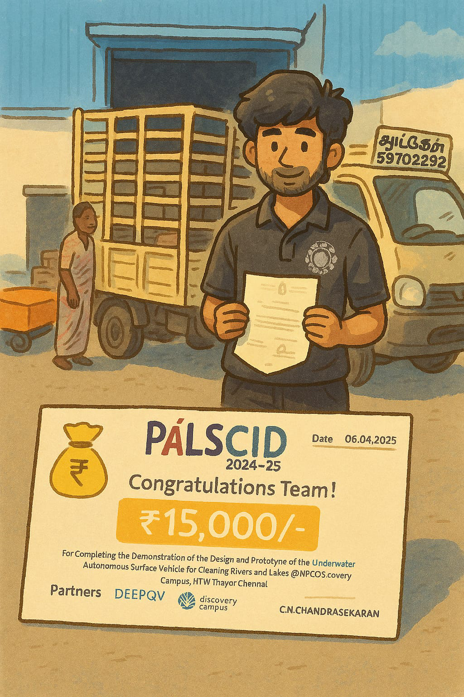

# GhibliArt

Transform your photos into beautiful Studio Ghibli-style artwork using AI! This project uses the Stable Diffusion model fine-tuned on Studio Ghibli artwork to create magical, anime-style transformations of your images.

## Features

- Convert any image into Studio Ghibli-style artwork
- Maintains the original composition while adding Ghibli's signature style
- Works with both CPU and GPU
- Simple command-line interface

## Installation

1. Clone this repository:
```bash
git clone https://github.com/yourusername/GhibliArt.git
cd GhibliArt
```

2. Install the required dependencies:
```bash
pip install -r requirements.txt
```

## Usage

Run the script with an input image:
```bash
python app.py path/to/your/image.jpg
```

Optional arguments:
- `--output`: Specify the output path for the generated image
```bash
python app.py path/to/your/image.jpg --output output_image.jpg
```

## Requirements

- Python 3.7+
- PyTorch
- Diffusers
- Pillow
- Matplotlib

All dependencies are listed in `requirements.txt`

## Example

Original Image | Ghibli Style
:------------:|:------------:
 | 

## License

This project is licensed under the MIT License - see the LICENSE file for details.

## Acknowledgments

- Uses the [nitrosocke/Ghibli-Diffusion](https://huggingface.co/nitrosocke/Ghibli-Diffusion) model
- Inspired by Studio Ghibli's beautiful artwork
